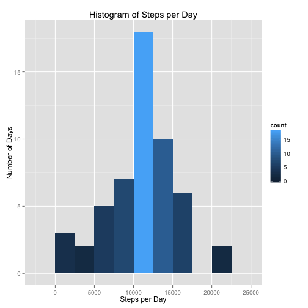
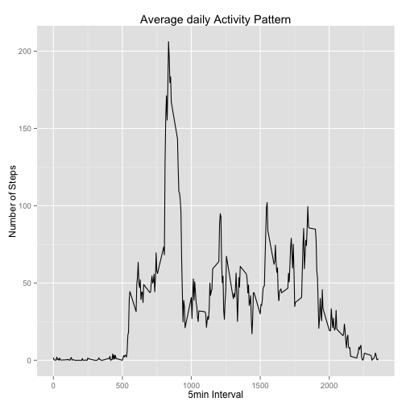
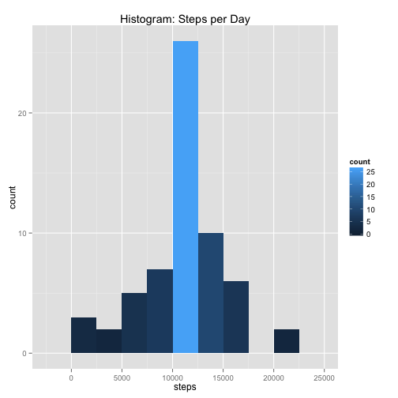
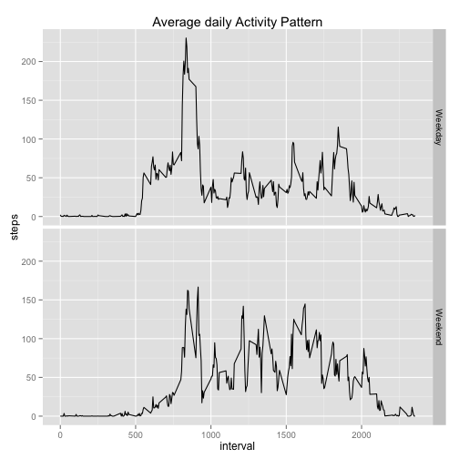

# Reproducable Data - Activity Monitoring Data

This is the report for first assignment of the Coursera Course on [Reproducible Research](https://www.coursera.org/course/repdata). It deals with the data of activity monitoring devices. The data contains step-counts of 5 minute intervals through out the day. 

## Loading and preprocessing of data

```r
# load ggplot for diagram plotting 
library(ggplot2)

# load data
dataRaw <- read.csv("activity.csv", header = TRUE)
```

```
## Warning in file(file, "rt"): kann Datei 'activity.csv' nicht öffnen: No
## such file or directory
```

```
## Error in file(file, "rt"): kann Verbindung nicht öffnen
```

```r
# extract all non-NA data. 
data<-dataRaw[!is.na(dataRaw$steps),]
```

The data for this assignment consists of the variables:

- Steps: Number of steps taking in a 5-minute interval (missing values are coded as NA)
- Date: The date on which the measurement was taken in YYYY-MM-DD format
- Interval: Identifier for the 5-minute interval in which measurement was taken

## Mean of total number of steps per day

```r
# aggregation of steps for each day
dataClustSteps<-(aggregate(data$steps,by=list(data$date),sum))
# rename the collumns
names(dataClustSteps) <- c( "day", "steps")

# create and plot historam of steps per day
p <- ggplot(  data = dataClustSteps ) 
p <- p + geom_histogram( aes( x = steps , fill = ..count..), binwidth = 2500  )
p <- p + ggtitle("Histogram of Steps per Day") 
p <- p + labs(x = "Steps per Day", y = "Number of Days" )
p
```

 

```r
# calculation of median of steps over all days 
mean(dataClustSteps$steps)
```

```
## [1] 10766.19
```

```r
# calculation of the median of steps over all days 
median(dataClustSteps$steps)
```

```
## [1] 10765
```

## Average daily Activity Pattern

```r
# aggregate the step counts over the 5-minute intervalls 
dataClustInterval<-aggregate(data$steps,by=list(data$interval),mean)
# rename the collumns
names(dataClustInterval)<-c("interval","steps")

# create and plot Average daily Activity Pattern of steps 
p2 <- ggplot(data = dataClustInterval, aes(x = interval, y = steps ))+ geom_line(weight=5)
p2 <- p2 + ggtitle("Average daily Activity Pattern") + labs(x = "5min Interval", y = "Number of Steps" )
p2
```

 

```r
# interval with maximum number of steps (on average)
dataClustInterval[ dataClustInterval$steps == max(dataClustInterval$steps),"interval"]
```

```
## [1] 835
```

## Missing values

```r
# Total number of missing values (observations) in the dataset
nrow(dataRaw) - nrow(data)
```

```
## [1] 2304
```

```r
# Strategy for filling in missing values
# mean (rounded) for the respective 5-minute interval is utilized to fill in the missing values 
fillValues <- function(dataLocal,dataClustInt) {
   for ( o in 1:nrow(dataLocal) )  {
      if ( is.na(dataLocal[o,"steps"]) )
      dataLocal[o,"steps"] <- floor(
         dataClustInt[ dataClustInt["interval"] == dataLocal[ o , "interval"], "steps" ])
   }
   dataLocal
}  
# new data set with substituted NA values
dataNew <- fillValues(dataRaw, dataClustInterval)

# aggregation of steps for each day for the new data set
dataClustStepsNew<-(aggregate(dataNew$steps,by=list(dataNew$date),sum))
# rename the collumns
names(dataClustStepsNew) <- c( "day", "steps")

# create and plot historam of steps per day
p3 <- ggplot( data = dataClustStepsNew ) + geom_histogram( aes( x = steps , fill = ..count..), binwidth = 2500  )
p3 <- p3 + ggtitle("Histogram: Steps per Day")
p3
```

 

```r
# calculation of median of steps over all days - new data set
mean(dataClustStepsNew$steps)
```

```
## [1] 10749.77
```

```r
# mean-difference of data set with and without substituted vales
mean(dataClustStepsNew$steps) - mean(dataClustSteps$steps)
```

```
## [1] -16.41819
```

```r
# calculation of the median of steps over all days - new data set
median(dataClustStepsNew$steps)
```

```
## [1] 10641
```

```r
# median-difference of data set with and without substituted vales
median(dataClustStepsNew$steps) - median(dataClustSteps$steps)
```

```
## [1] -124
```

### Activity patterns of weekdays and weekends

```r
# new factor: weekday {"weekend" for days, which are Satturday or Sunday, rest is "weekday"}
dataNew$day <- weekdays(as.POSIXlt.date(format(dataNew$date, format="%Y %m %d")), abbreviate = TRUE)

# recluster Satturday and Sunday into "Weekend" and the remaining days into "Weekday"
dataNew$day[dataNew$day == "Sa" | dataNew$day == "So"  ] <- "Weekend"
dataNew$day[dataNew$day != "Weekend"] <- "Weekday"

# aggregate the step counts over the 5-minute intervalls for all "Weekend"-days
dataNewWE <- dataNew[dataNew$day == "Weekend" , ]
dataClustIntervalWE<-aggregate(dataNewWE$steps , by = list(dataNewWE$interval) , mean)
names(dataClustIntervalWE)<-c("interval","steps")
dataClustIntervalWE$day <- "Weekend"

# aggregate the step counts over the 5-minute intervalls for all "Weekday"-days
dataNewWD <- dataNew[dataNew$day == "Weekday" , ]
dataClustIntervalWD<-aggregate(dataNewWD$steps , by = list(dataNewWD$interval) , mean)
names(dataClustIntervalWD)<-c("interval","steps")
dataClustIntervalWD$day <- "Weekday"

# combine both clustered data frames
dataNewClustInterval <- rbind(   dataClustIntervalWD ,   dataClustIntervalWE  )

# creating of an comparring plot 
p <- ggplot(data = dataNewClustInterval, aes(x = interval, y = steps ) ) + geom_line(weight=5)
p <- p + ggtitle("Average daily Activity Pattern") + facet_grid(day ~ .)
p
```

 
